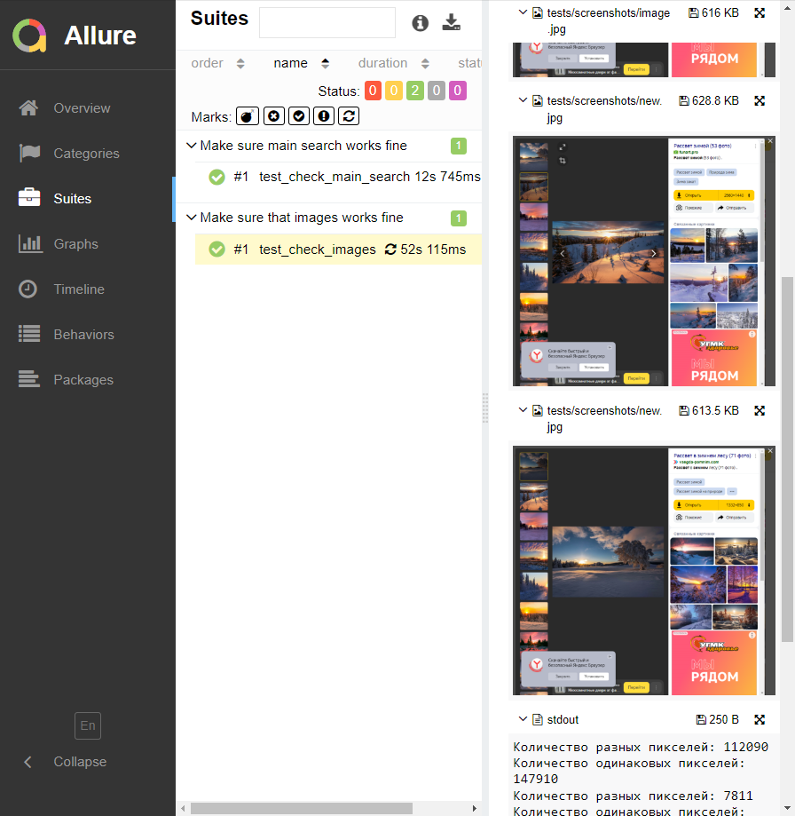

Files
-----

[conftest.py](conftest.py) contains all the required code to catch failed test cases and make screenshot
of the page in case any test case will fail.

[pages/base.py](pages/base.py) contains PageObject pattern implementation for Python.

[pages/elements.py](pages/elements.py) contains helper class to define web elements on web pages.

[tests/test_smoke_yandex.py](tests/test_smoke_yandex.py) contains several smoke Web UI tests for Yandex


How To Run Tests
----------------

1) Install all requirements:

    ```bash
    pip install -r requirements.txt
    ```

2) Download Selenium WebDriver from https://chromedriver.chromium.org/downloads (choose version which is compatible with your browser)

3) Run tests:

    ```bash
    python -m pytest -v --driver Chrome --driver-path ~/chrome tests
    ```

   

Note:
~/chrome in this example is the file of Selenium WebDriver downloaded and unarchived on step #2.

4) Run test with allure report:
   
   ```bash
   python -m pytest -v --driver Chrome --driver-path ~/chrome --alluredir=reports tests
   ```

5) To load allure report:

```bash
irm get.scoop.sh | iex
allure serve reports
 ```

   

   
